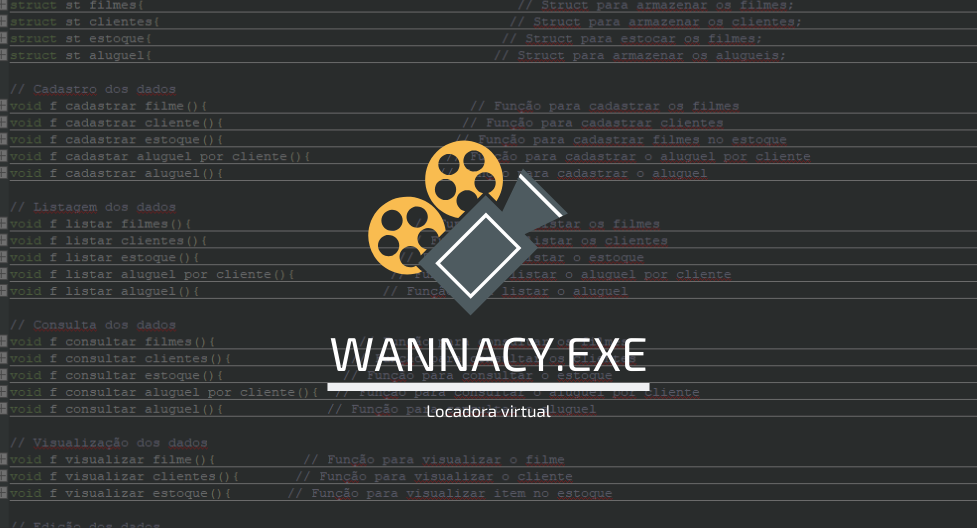

<!-- PROJECT SHIELDS -->
[![Forks][forks-shield]][forks-url]
[![Stargazers][stars-shield]][stars-url]
[![Issues][issues-shield]][issues-url]
[![MIT License][license-shield]][license-url]
[![LinkedIn][linkedin-shield]][linkedin-url]

<!-- PROJECT LOGO -->
<br />
<p align="center">
  <a href="https://github.com/Duduxs/Projeto-Locadora">
    
  </a>

  <h3 align="center">Locadora</h3>

  <p align="center">
    Uma locadora virtual desenvolvida em C
    <br />
    <a href="https://github.com/Duduxs/Programacao"><strong>Veja outros programas »</strong></a>
    <br />
    <br />
    <a href="https://github.com/Duduxs/Projeto-Locadora/issues">Reporte um Bug</a>
  </p>
</p>

<!-- TABLE OF CONTENTS -->
## Índice

* [Sobre o projeto](#sobre-o-projeto)
  * [Feito com](#feito-com)
* [Começando](#Começando)
  * [Pré-requisitos](#pré-requisitos)
  * [Instalação](#instalação)
* [Contribuição](#contribuição)
* [Licença](#licença)
* [Contato](#contato)
* [Reconhecimentos](#reconhecimentos)

<!-- ABOUT THE PROJECT -->
## Sobre o projeto

[![Tela da Locadora][product-screenshot]](https://github.com/Duduxs/Projeto-Locadora/blob/master/img/animacao.gif)

* Descrição:       Uma locadora aluga filmes de diversas categorias como terror, infantil, romance entre
                   outros. Esse tipo de negócio tem espaço no mercado devido o alto custo do cinema e a
                   maior fiscalização de filmes piratas. Assim, tem-se tornado uma tarefa difícil administrar
                   esse tipo de negócio sem auxílio de um programa, então, a fim de facilitar a vida dos
                   empresários deseja-se oferecer um programa para gerenciamento de funções básicas de
                   uma locadora. Através do programa será possível cadastrar filmes e clientes.

* Desenvolvimento: Através da proposta, criei uma locadora virtual utilizando a linguaguem C e a IDE Codeblocks::. E também através de                      ponteiros e arquivos simulei um pequeno banco de dados para a entrada de filmes e/ou estoques. Utilizei o GIT para                      versionamento do código, assim tendo o maior controle possível sobre o projeto. Ao fazer o programa destaquei 4                          funções principais, a primeira função para cadastrar um filme na parte lógica da locadora, a segunda para cadastro de                    cliente, a terceira para cadastrar o filme na parte física da locadora (Estoque) e por último um menu para alugar os                    filmes. O programa foi desenvolvido com base na estrutura de dados *STACK (LIFO)*.       

* Conclusão:       Uma vez que tive que fazer tudo sozinho não foi fácil. Quando eu criava algo dentro do programa eu sempre tinha que                      testar e isso demorava bastante tempo. Acarretou que passei noites em claro sempre pensando na melhor forma de                          resolver aquele bug que tinha aparecido no software, entretanto foi uma experiência incrível, nunca havia usado o C                      para programar antes e acabei descobrindo várias funcionalidades legais ao desenrolar do projeto, sobretudo a                            experiência na linguaguem. 

### Feito com

* [Codeblocks IDE](http://www.codeblocks.org/)
* [C](http://linguagemc.com.br/o-que-e-linguagem-c/)
* [GIT](https://git-scm.com/)

<!-- GETTING STARTED -->
## Começando

Por ser tratar de um projeto simples, você não irá precisar de muita coisa. É recomendável que você use a versão mais recente da sua IDE para rodar o programa sem quaisquer problemas.

### Pré-requisitos

Alguns comandos e bibliotecas infelizmente só funcionam corretamente no windows.  

* Windows
* IDE para C

### Instalação

1. Clone o repositório
```sh
git clone https://github.com/Duduxs/Projeto-Locadora.git
```
2. Copie o CF do documento Locadora.c 

3. Cole em sua IDE e execute

<!-- CONTRIBUTING -->
## Contribuição

Contribuições são o que tornam a comunidade de código aberto um lugar incrível para aprender, inspirar e criar. Todas as contribuições que você fizer para esse projeto irei ficar **muito grato**.

1. Fork o Projeto
2. Crie uma Feature Branch 
3. Commit as alterações 
4. Dê um Push origin para o Branch 
5. Abra uma Pull Request

<!-- LICENSE -->
## Licença

Distribuído pela MIT License. Consulte o arquivo `LICENSE.txt` para mais informações.

<!-- CONTACT -->
## Contato

Eduardo José - [duduxss3@gmail.com]

Link do projeto : [https://github.com/Duduxs/Projeto-Locadora](https://github.com/Duduxs/Projeto-Locadora)

<!-- ACKNOWLEDGEMENTS -->
## Reconhecimentos
* [Shields](https://shields.io)
* [Licença](http://escolhaumalicenca.com.br/)
* [Agradecimento pela Template](https://github.com/othneildrew)
* [Logo](https://www.canva.com)
* [Agradecimento pela proposta do projeto](https://www.linkedin.com/in/brunom4ciel)


<!-- MARKDOWN LINKS & IMAGES -->
[forks-shield]: https://img.shields.io/badge/forks-0-blue
[forks-url]: https://github.com/Duduxs/Projeto-Locadora/network/members
[stars-shield]: https://img.shields.io/badge/stars-0-blue
[stars-url]: https://github.com/Duduxs/Projeto-Locadora/stargazers
[issues-shield]: https://img.shields.io/github/issues/othneildrew/Best-README-Template.svg?style=flat-square
[issues-url]: https://github.com/Duduxs/Projeto-Locadora/issues
[license-shield]: https://img.shields.io/github/license/othneildrew/Best-README-Template.svg?style=flat-square
[license-url]: https://github.com/Duduxs/Projeto-Locadora/blob/master/LICENSE.txt
[linkedin-shield]: https://img.shields.io/badge/-LinkedIn-black.svg?style=flat-square&logo=linkedin&colorB=555
[linkedin-url]: https://www.linkedin.com/in/eduardo-josé-souza-de-oliveira-b51985176/
[product-screenshot]: img/animacao.gif
